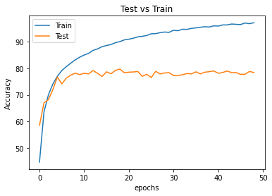

# Train Model on CIFAR to achieve 85% Validation Accuracy

The idea of the implementation in this repository was to achieve 85% validation accuracy for CIFAR 10 dataset. The inspiration was to understand how subtle changes in the model architecture led to achieving the target.

The Goal we set were:

* Total Number of parameters: **Less than 100k**
* Number of Epochs: **No limit**
* Training process: Difference between train accuracy and validation accuracy **should not go higher than 2% - 3%**.
* **Try different Convolution layer types** like Dilation Convolution Layer or Depthwise Separable Convolution Layer.
* **Try not to use Max Pool** to reduce the feature size.
* Receptive Field of the network: **Greater than 52**

Having our goal set, we decided to try to approach the problem in small steps. These steps were the minor changes with respect to the network architecture. The below list gives you an overview of how the changes were considered.

1. Vanilla Model with Max Pool - [Notebook 1](./notebooks/CIFAR10_01_MaxPooled.ipynb)
2. Remove Max Pool and proceed with Convolution Layer with Stride of 2 - [Notebook 2](./notebooks/CIFAR10_02_StridedConv.ipynb)
3. Add Image Augmentations - [Notebook 3](./notebooks/CIFAR10_03_ImgAug.ipynb)
4. Use Depthwise Separable Convolution Layers - [Notebook 4](./notebooks/CIFAR10_04_DepthConv.ipynb)
5. Use Dilated Convolution Layers - [Notebook 5](./notebooks/CIFAR10_05_Dilated.ipynb)
6. Use Depthwise Separable Convolution Layers instead of traditional Convolution layers through out the network - [Notebook 6]()
7. Go All In with building a complex network architecture - [Notebook 7](./notebooks/CIFAR10_07_All_IN.ipynb)

The rationale behind using these steps are explained in the analysis section of each observation below.

## Results Observed

### Model 1: Vanilla Model

#### Observed Values

* *Number of Parameters:* 82,298
* *Number of Epochs:* 50
* *Validation Accuracy:* 79.67
* *Training Accuracy:* 97.02
* *Max Receptive Field:* 68

#### Resultant Graphs

#### Analysis

The training loss and the validation loss proceed in the same direction till around 11th Epoch. After that, the losses started to diverge indicating the model was getting overfit. To overcome the issue of overfitting, we decided to remove Max Pool layers and replace it Convolution layer with stride of 2 to act like Max Pool.

### Model 2: Without Max Pool

#### Changes compared to Model 1

Removed all Max Pool layer and replaced it with Strided Convolution Layers with stride of 2.

#### Observed Values

* *Number of Parameters:* 1,65,562
* *Number of Epochs:* 50
* *Validation Accuracy:* 78.18
* *Training Accuracy:* 98.66
* *Max Receptive Field:* 75

#### Resultant Graphs

#### Analysis

By changing all the Max Pool layers to Strided Convolution layers, the number parameters jumped from 82,298 to 1,65,562. Even though there was a huge shift in the number of parameters, the progression of training of the model was very similar to the training of Model 1. The issue here was that the images used for training were comparatively easier to the data that was present in the test set. So, to make it difficult for training process, we decided to go with Image Augmentation.

### Model 3: Model 2 + Image Augmentation

#### Changes compared to Model 2

The image augmentations that we used were:

* **ShiftScaleRotate** with shift limit of *0.05*, scale limit of *0.01* and rotate limit is *7°*.
* **HorizontalFlip** with probability of *50%*.
* **CoarseDropout** with values of *max_holes: 1, max_height:16, max_width:16, min_holes: 1, min_height:16, min_width:16, fill_value:[0.4914, 0.4822, 0.4465], mask_fill_value: None*
* **ToGray** with probability of *50%*.

#### Image Augmentation Example

#### Observed Values

* *Number of Parameters:* 96,490
* *Number of Epochs:* 100
* *Validation Accuracy:* 86.23
* *Training Accuracy:* 83.12
* *Max Receptive Field:* 75

#### Resultant Graphs

#### Analysis

As soon as we added Image Augmentation, the model accuracy was underfit. This gave us an opportunity to increase the number of epochs from 50 to 100. This helped us achieve the target accuracy of 85%. Even though we achieved the target accuracy, we wanted to try how the network would behave when we added Depthwise Separable Convolutions and Dilated Convolutions.

### Model 4: Model 3 + Depthwise Separable Convolutions

#### Changes compared to Model 3

Add Depthwise Separable Convolutions at particular layers.

#### Observed Values

* *Number of Parameters:* 97,546
* *Number of Epochs:* 100
* *Validation Accuracy:* 86.64
* *Training Accuracy:* 83.43
* *Max Receptive Field:* 89

#### Resultant Graphs

#### Analysis

Addition of Depthwise Separable Convolutions enabled us to increase the number of parameters in other layers. The accuracy didn't vary by a huge margin but we understood how to add depthwise separable convolution layers and how it leads to reduced number of parameters. 😋

### Model 5: Model 4 + Dilated Convolutions

#### Changes compared to Model 4

Added Dilated Convolution layers in the beginning of each block of the network.

#### Observed Values

* *Number of Parameters:* 69,706
* *Number of Epochs:* 300
* *Validation Accuracy:* 85.08
* *Training Accuracy:* 82.83
* *Max Receptive Field:* 509

#### Resultant Graphs

#### Analysis

Addition of the Dilated Convolution layers increased the Receptive Field by a huge margin. This led to difficulty in learning images with small object size. So the accuracy dropped from 86.63% previously to 85.08%. So to overcome this issue, we decided to use only one dilated layer and convert all convolution layers to depthwise separable convolution layers.

### Model 6: Model 5 + All Depthwise Separable Convolution

#### Changes compared to Model 5

Used only one dilated layer and convert all convolution layers to depthwise separable convolution layers.

#### Observed Values

* *Number of Parameters:* 33,994
* *Number of Epochs:* 500
* *Validation Accuracy:* 85.08
* *Training Accuracy:* 82.83
* *Max Receptive Field:* 147

#### Resultant Graphs

#### Analysis

### Model 7: Custom Architecture

#### Changes in the Model Architecture

We went with a custom approach. In the model architecture, we removed strided convolutions and used dilated convolutions to reduce the input feature size.

#### Observed Values

* *Number of Parameters:* 88,384
* *Number of Epochs:* 250
* *Validation Accuracy:* 87.45
* *Training Accuracy:* 85.99
* *Max Receptive Field:* 467

#### Resultant Graphs

#### Analysis

We achieved the best validation accuracy of 87.45% using this network architecture. The difference of the model architecture compared to other architectures is that, we didn't use dilated convolutions in-between the layers. We used it to full fill the purpose of Max Pool. This increased the receptive field to 467. But, since the network had large number of parameters, it was able to learn based on the images provided and achieve results way better than the target. Having a very high receptive field also caused an issue where the model was not able to learn the representation of small objects. We have provided how the model was behaving with incorrect classification samples and confusion matrix.

##### Incorrect Predictions

##### Confusion Matrix

## Receptive Field Calculations

The receptive Field calculations for each network can be viewed here: [Link](https://docs.google.com/spreadsheets/d/1HaES-XtkUb86mPW8PaTGa-gEWQQ35IYYIkccljW-9W0/edit?usp=sharing)
You can download the excel sheet here: [Link](./Receptive_Field_Calculations.xlsx)

## Collaborators

* Kaustubh Harapanahalli
* Syed Abdul Khader
* Varsha Raveendran
* Kushal Gandhi

[Equal Contributions]
